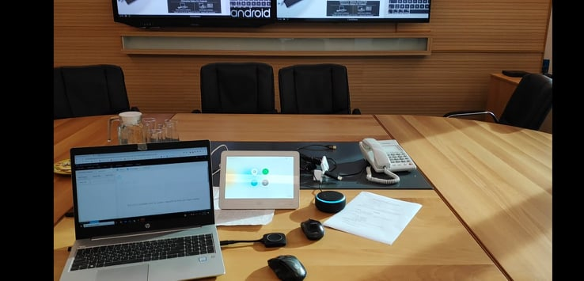
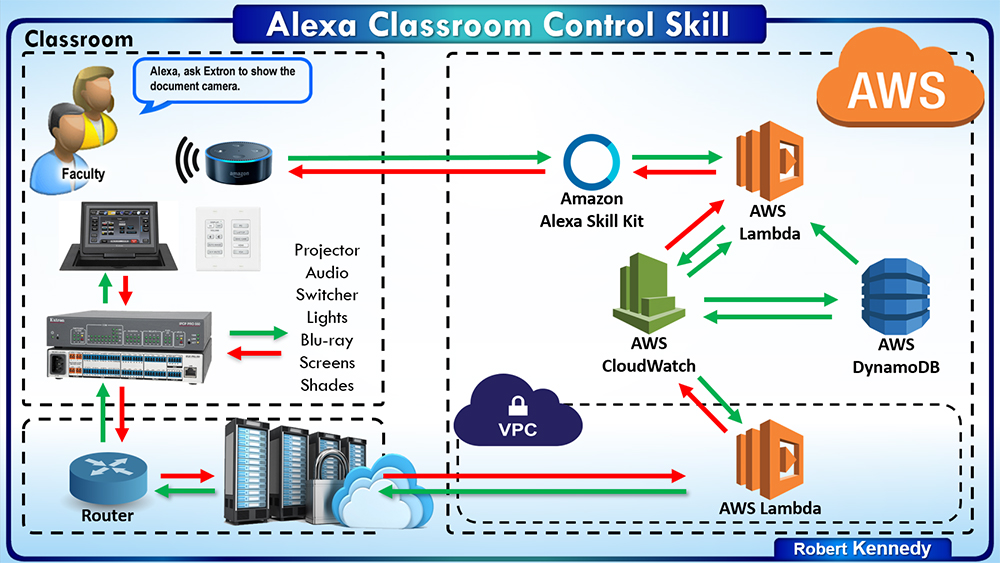

# Alexa-Skill-kit-for-Extron-Control-System

The purpose of this projects is to let video conference room users to control the basic room function with voice commands.
Our room is based on Extron control processor IPCP PRO 350 and the Smart speaker with Alexa is the Echo Dot (3rd Gen).
So in this project both Amazon Alexa and Extron Controller where programmed to cooperate.
Fistly i used alexa developer console to create a new skill that contains all the key words that are related with the room fuctions. 
The second step was to create a new function in the Amazon AWS Lambda with Python. This function receives the incoming json output from the AI voice recognition 
and the send the appropriate comand to the controller. 
Finally the controller receives the command and then runs the deddicated function for the room automation sequence.

#How it works
--------------------------------------------------------------------------------------------------------------------------------
#Images

 

# Check-it-on-Youtube
Link:https://youtu.be/hlUI-A3MYXQ
